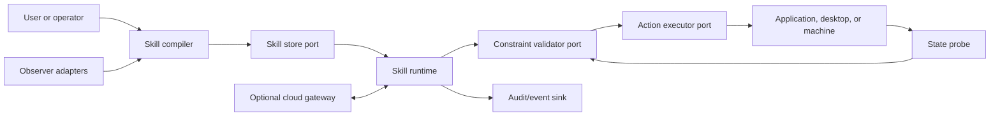

# Workflow-GPS development coordination

Status: working architecture and delivery agreement
Last updated: 2026-06-28

## Purpose

This document coordinates development of Workflow-GPS from a local self-healing agent
engine into a system that can learn reusable operational skills from demonstrations,
validate them against application and physical constraints, and deploy through local,
cloud, or hybrid execution modes.

It is the canonical reference for architectural boundaries, sequencing, acceptance
criteria, and safety expectations. Material changes should be recorded in an Architecture
Decision Record (ADR) before implementation.

## North star

Workflow-GPS should let a person demonstrate a task once, compile that demonstration into
a semantic and parameterized skill, validate the skill through the authoritative
application or simulation, and reuse it without another model call when the same
conditions apply.

The eventual operating loop is:

```text
demonstrate -> observe -> compile -> validate -> store
            -> retrieve -> simulate -> approve -> execute -> audit
```

For physical systems, simulation, constraints, approval, and emergency controls remain
mandatory. A model may propose an operation; it may not declare an invalid operation
valid or override a failed solver.

## Locked architectural principles

1. **Semantic actions before screen imitation.** Prefer application APIs, then CLI,
   accessibility controls, and only then raw mouse/keyboard coordinates.
2. **Authoritative constraints stay authoritative.** CAD kernels, physics simulators,
   type systems, and application validators decide whether an outcome is valid.
3. **Models compile skills; they are not required to replay known skills.** Reuse a
   verified skill deterministically when its signature and preconditions match.
4. **Local-first, cloud-capable.** Domain logic depends on ports, never directly on
   SQLite, PostgreSQL, HTTP, cloud queues, desktop APIs, or a vendor SDK.
5. **Execution stays near the controlled resource.** A cloud gateway may plan and
   coordinate, but a local agent owns desktop, private API, CAD, and hardware execution.
6. **Credentials are references, not skill data.** Skills may contain a credential name
   but never a token, password, session cookie, or private key.
7. **Every action is attributable and reversible where possible.** Preserve provenance,
   inputs, outputs, validation results, failures, approvals, and undo/recovery metadata.
8. **Physical autonomy is earned in stages.** No direct hardware execution until digital
   twin, safety-envelope, human-approval, and emergency-stop gates are satisfied.

## System boundaries



The skill compiler, models, signatures, policy evaluation, and validation orchestration
form the portable core. Storage, transport, observation, execution, secrets, and vendor
integration are replaceable adapters.

## Core ports

The first implementation must define versioned protocols for:

- `ObserverAdapter`: emits semantic action events and state snapshots.
- `ActionExecutor`: executes a typed action and returns a structured outcome.
- `StateProbe`: captures relevant before/after application state.
- `ConstraintValidator`: validates preconditions, invariants, and results.
- `SkillStore`: stores demonstrations, compiled skills, versions, and statistics.
- `ArtifactStore`: stores larger files, screenshots, models, and simulation outputs.
- `SecretProvider`: resolves credential references at execution time.
- `GatewayClient`: leases tasks and synchronizes approved metadata with a remote service.
- `EventSink`: records append-only audit and telemetry events.
- `ApprovalProvider`: obtains human or policy approval for guarded operations.

Domain code must be testable with in-memory implementations of every port.

## Deployment compositions

| Concern | Local desktop/app | Cloud gateway | Hybrid local agent |
| --- | --- | --- | --- |
| Skill metadata | SQLite | PostgreSQL | Local cache plus scoped synchronization |
| Large artifacts | Filesystem | Object storage | Local staging plus signed upload |
| Execution | Direct local adapter | Isolated remote worker | Local execution from leased task |
| Secrets | Environment or OS vault | KMS/secret manager | Local credential reference resolution |
| Events | In-process append log | Queue/event stream | Durable outbound stream |
| Identity | Local user/profile | Tenant and principal | Device, user, and tenant |
| Connectivity | Offline-capable | Network-required | Continues within an explicit offline policy |

The hybrid agent must initiate outbound authenticated connections. The cloud gateway must
not directly open a control channel into a user desktop or machine network.

## Manual provider configuration

Local users must be able to configure private APIs without modifying core code. Provider
profiles should follow a versioned shape similar to:

```yaml
schema_version: 1
provider: solidworks
mode: local
adapter: solidworks-com
endpoint: local-com
credential_ref: windows-vault/solidworks
capabilities:
  - open_document
  - create_feature
  - validate_constraints
policy:
  require_approval_for_write: true
```

Adapters must advertise actual capabilities at runtime. Configuration declares desired
capabilities; capability negotiation determines what is available.

## Canonical data model

The portable core will begin with these records:

- `ActionEvent`: actor, adapter, semantic operation, typed parameters, time, and
  correlation identifiers.
- `StateSnapshot`: normalized state fingerprint plus selected inspectable state.
- `Demonstration`: ordered actions, before/after snapshots, artifacts, and outcome.
- `SkillSignature`: normalized intent, application/version, adapter, environment,
  constraints, schema version, and relevant artifact fingerprints.
- `ReusableSkill`: parameters, preconditions, action program, validators, recovery, and
  provenance.
- `Constraint`: identifier, severity, authoritative validator, and expected result.
- `ExecutionOutcome`: status, state delta, evidence, timing, errors, and recovery status.
- `ApprovalRecord`: approver, policy, decision, scope, expiration, and evidence hash.

Records crossing process or network boundaries require an explicit `schema_version`.
Identifiers must support idempotency, retries, deduplication, and audit reconstruction.

## Learning pipeline

1. Capture a demonstration through the highest-quality available observer.
2. Redact secrets and exclude irrelevant volatile state.
3. Record semantic actions and before/after state.
4. Compare repeated demonstrations to separate constants from parameters.
5. Compile a candidate skill.
6. Replay in a disposable environment or copied artifact.
7. Run authoritative validators.
8. Store only after validation succeeds.
9. Track success, failure, application drift, and invalidation signals.
10. Require revalidation when a signature component changes.

Raw screenshots and mouse coordinates are evidence, not the preferred skill language.

## Development phases

### Phase 0: baseline stabilization

Deliverables:

- Commit and tag the V0.1 baseline.
- Version all SQLite schemas and add migration tests.
- Finish secret redaction and packaging checks.
- Separate stable engine features from experimental reply-learning features.

Exit gate: clean installation in a fresh environment, green offline test suite, and no
known credential leakage.

### Phase 1: skill foundation

Deliverables:

- Add the canonical records and core ports.
- Implement in-memory and local SQLite/filesystem adapters.
- Add skill signing/fingerprinting, provenance, and invalidation metadata.
- Add `skill-list`, `skill-inspect`, and safe `skill-replay` commands.

Exit gate: the same contract tests pass against in-memory, local, and remote-mock ports.

### Phase 2: CLI and API demonstrations

Deliverables:

- CLI observer for command, arguments, working directory, exit status, output, and
  artifact changes.
- API wrapper for typed calls, responses, errors, and state deltas.
- Allow-list policy, secret scrubbing, dry-run, and destructive-operation approval.

Exit gate: record one deterministic workflow, replay it without a model, and verify the
same resulting state.

### Phase 3: Blender semantic adapter

Deliverables:

- Record `bpy` operations, scene units, objects, transforms, modifiers, and constraints.
- Compile demonstrations into parameterized Python skills.
- Replay headlessly on copied `.blend` files.
- Validate scene fingerprints, dimensions, relationships, and collision expectations.

Exit gate: replay a demonstrated modeling operation in a fresh scene without mouse
coordinates and pass all declared validators.

### Phase 4: desktop observation

Deliverables:

- Windows UI Automation adapter using stable control identifiers and values.
- Window, application-version, focus, and state guards.
- Screenshot evidence and raw input fallback for otherwise inaccessible operations.

Exit gate: replay survives window movement and display scaling; coordinate-only skills
are clearly marked low-confidence and require approval.

### Phase 5: engineering CAD

Deliverables:

- FreeCAD/OpenCascade adapter for open parametric prototyping.
- SolidWorks COM adapter for production workflows.
- Typed support for units, tolerances, dimensions, equations, mates, materials,
  interference, solver state, and manufacturability checks.

Exit gate: no artifact is accepted while its authoritative solver or required engineering
validator reports failure.

### Phase 6: gateway and hybrid deployment

Deliverables:

- Remote implementations of skill, artifact, event, and task-lease ports.
- Tenant isolation, device identity, scoped synchronization, revocation, and audit.
- Outbound local-agent connection with signed, expiring, idempotent tasks.

Exit gate: one skill executes unchanged through local-only and hybrid compositions, and
network loss follows a tested policy.

### Phase 7: simulation and robotics

Deliverables:

- Digital-twin and simulator adapters.
- Safety envelopes, approval workflows, rate/force/workspace limits, and emergency stop.
- Hardware adapters only after simulation and policy gates are enforced independently.

Exit gate: a failed validator, expired approval, communication loss, or emergency stop
prevents or safely halts physical execution.

## First implementation sprint

1. Write ADR-001 defining the portable core and composition roots.
2. Define the canonical Pydantic records and serialization versions.
3. Define all core protocols without vendor imports.
4. Implement in-memory stores and fake observer/executor/validator adapters.
5. Implement the local SQLite skill store with migrations.
6. Add contract tests shared by all store and adapter implementations.
7. Add `skill-list`, `skill-inspect`, and non-destructive `skill-replay` scaffolding.
8. Record and replay one harmless CLI demonstration.
9. Run the same flow against a remote mock gateway.

Sprint acceptance: one demonstration becomes a verified reusable skill, replays locally
without a model, and passes identical contracts through the remote mock composition.

## Coordination rules

### Architecture decisions

- Add ADRs under `docs/adr/` using sequential identifiers.
- ADRs must state context, decision, alternatives, consequences, and migration impact.
- Changes to a core port, network contract, safety boundary, or canonical record require
  an ADR.

### Work units

- Each issue should name its phase, port/adapter, schema impact, safety impact, and exit
  criteria.
- Keep adapters in separate modules from domain logic.
- Avoid mixing schema migrations, broad refactors, and new vendor behavior in one change.

### Test matrix

Every new subsystem should include:

- Pure unit tests.
- Shared protocol/contract tests.
- Offline fake-adapter tests.
- Local integration tests where available.
- Remote-mock tests for network-capable ports.
- Failure, retry, idempotency, and migration tests.
- Security tests for redaction, scope isolation, and authorization boundaries.

Vendor applications and hardware tests must be explicitly marked and must not be needed
for the default offline suite.

### Adapter acceptance checklist

An adapter is not complete until it declares:

- Supported versions and capabilities.
- Required credentials and permissions.
- Read versus write operations.
- Idempotency and retry behavior.
- State probes and validators.
- Timeout, cancellation, and recovery behavior.
- Secret and personal-data handling.
- Local, cloud-worker, and hybrid compatibility.

## Safety and security gates

- No secrets in prompts, skills, events, artifacts, or logs.
- No destructive replay without an explicit policy and approval record.
- No desktop replay without application/window/state verification.
- No engineering artifact accepted with unresolved solver or validator failures.
- No physical action without simulation, bounded operating policy, and emergency stop.
- No cross-user or cross-tenant skill reuse without explicit provenance and sharing policy.
- No silent fallback from semantic APIs to raw mouse/keyboard control.

## Current non-goals

- Learning arbitrary physical laws from screenshots alone.
- Treating a successful model response as proof of engineering correctness.
- Automating normal personal messaging accounts through unsupported impersonation.
- Allowing a cloud service unrestricted control of a local desktop or machine.
- Generalizing a single demonstration into a high-risk physical operation without
  independent validation.

## Open decisions

These require ADRs before their associated phase begins:

- Skill program representation: typed action graph, Python subset, or both.
- Artifact content-addressing and signing format.
- Remote protocol: HTTP/gRPC plus event transport.
- Conflict resolution for offline skill edits and synchronization.
- Approval-policy language and delegation model.
- Simulation evidence format and required confidence thresholds.
- Retention and deletion policy for demonstrations containing personal information.

## Definition of done

A feature is done only when:

- Its behavior is expressed through portable core contracts.
- Local and remote-mock compositions pass the same contract tests.
- Schemas and migrations are versioned.
- Failure, cancellation, retry, and invalidation behavior are tested.
- Credentials and sensitive data are demonstrably excluded from persisted records.
- Documentation includes configuration, limitations, and recovery.
- The relevant phase exit gate remains satisfied.
